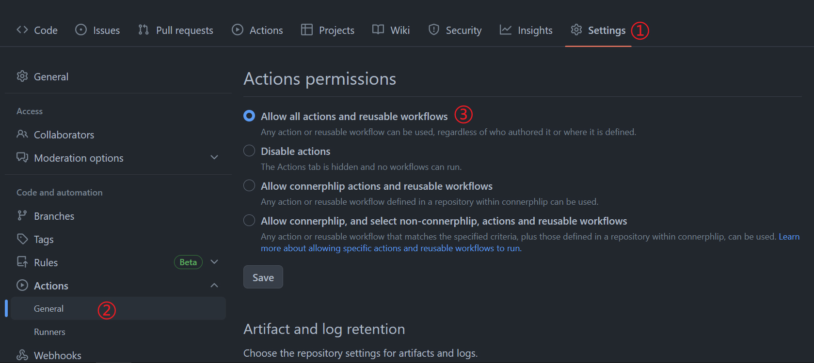
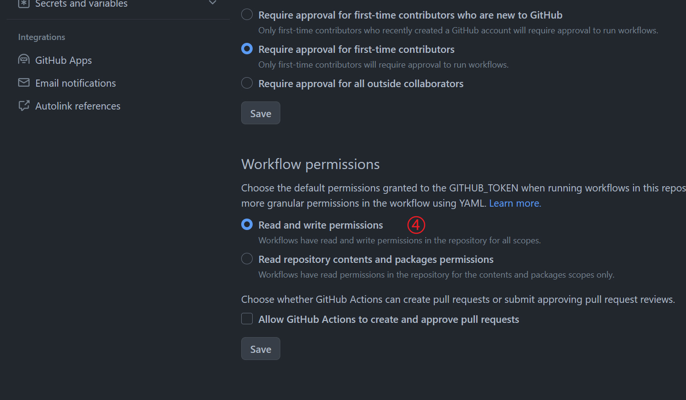

# Create a Blog by Github Pages

I want to show my information to others by the blog, but I don't want to spend a lot of effort creating it from scratch by HTML. 

## Demand

- I have been taking notes by markdown, so it is necessary for this tool to convert markdown to HTML .
    - To achieve this function, there are a lot of tools, such as sitdown, Markdown2Html, typora, etc.
- I don't want to organize these files by myself, it is handy for me to automatically organize these files.
    - jekyll, hugo, hexo, gitbook, mdbook, etc.
  
- It is very troublesome to set up the toolchain and configure the environment.

  According to the above requirements, I chose mkdocs to build the blog, it is integrated in Python and requires very little learning cost. In the next few chapters, I'll show you how to build a blog from scratch by Github Pages.

## Tutorials

### Install Python

- It is easy for you to install Python, if you have some problem, please follow the tutorials on the [Python](https://wiki.python.org/moin/BeginnersGuide/Download) website.
- In addition, please install `pip` or `pip3` tool in you computer, because it is not standard software on some Linux distributions. 
- Please install Python with a version number greater than 3.8.2, the minimum version requirement for `mkdocs` is 3.8.2.

### Install mkdocs

- Please install `mkdocs` and `material for mkdocs` with the following code

    ```shell
    pip install mkdocs
    pip install mkdocs-material
    ```


### Clone the Repository

- Clone the project from my Github Pages' [repository](https://github.com/connerphlip/connerphlip.github.io)
- You can also download it from [here](./files/blog_templete.zip)

### Configure Your Personal Setting

- Edit `mkdocs.yml` file and `docs` dictionary to put your own content.
- There is a dictionary named by `mkdocs`, please do NOT delete it, it will prompt some errors if you delete it.

### Publish

- Now, you can publish your blog to Github, use `git` or `Vscode` to creat and push your repository to `<your_username>.github.io`.
- Change the Github Pages `Actions permissions` by the following step.
    - 

- Change the Github Pages `Workflow permissions` by the following step.
    - 

### Finish

- You can view you website at your Github Pages if it finished the build and deploy.


<!-- Google tag (gtag.js) --> <script async src="https://www.googletagmanager.com/gtag/js?id=G-HBS60FDTSC"></script> <script>  window.dataLayer = window.dataLayer || [];  function gtag(){dataLayer.push(arguments);}  gtag('js', new Date());   gtag('config', 'G-HBS60FDTSC'); </script>
